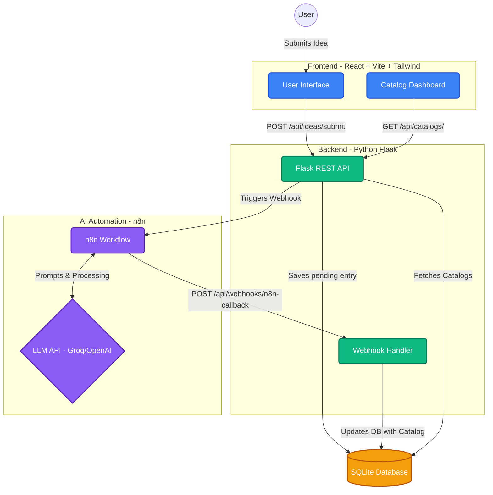

# MindInspo - Idea Incubator

MindInspo is an AI-powered idea incubator that transforms raw ideas, tool names, or concepts into comprehensive, structured technical catalogs.

## Features

- **Idea Submission**: Submit a raw idea or a concept.
- **AI Processing**: An automated n8n workflow processes the idea using AI.
- **Technical Catalogs**: Automatically generates a structured technical catalog comprising:
  - Project summary
  - Recommended tech stack
  - Pros and cons
  - Similar tools
  - System architecture diagram (Mermaid syntax)
  - Generated image prompt/concept
- **Dashboard**: A React-based interface to view and manage generated catalogs.

## Architecture

The project consists of three main components: a Python Flask Backend, a React + Vite Frontend, and an n8n AI Workflow.



### Components Details

1. **Frontend (`/frontend`)**:
   - Built with React, Vite, and Tailwind CSS.
   - Provides an elegant UI for users to submit their ideas and view the generated technical catalogs.
   - Communicates with the Flask backend via REST APIs.

2. **Backend (`/backend`)**:
   - Built with Python and Flask.
   - Manages the SQLite database using SQLAlchemy.
   - Handles API requests from the frontend and webhooks from the n8n workflow.
   - Models include `User` and `CatalogEntry` to store the generated data.

3. **n8n Automation Engine**:
   - A workflow orchestrator (typically hosted separately or locally) that listens to webhook triggers from the backend.
   - Uses an LLM to generate the comprehensive technical catalog details (summary, stack, pros/cons, etc.) based on the user's raw input.
   - Sends a callback to the Flask backend to update the `CatalogEntry` status to `completed`.

## Quick Start

### Backend

1. Navigate to the `backend` directory:
   ```bash
   cd backend
   ```
2. Create and activate a virtual environment (optional but recommended):
   ```bash
   python -m venv backend_venv
   source backend_venv/bin/activate  # On Windows: backend_venv\Scripts\activate
   ```
3. Install dependencies:
   ```bash
   pip install flask flask-cors flask-sqlalchemy python-dotenv
   # ... plus any other required packages
   ```
4. Start the Flask server:
   ```bash
   flask run
   # Server runs on http://127.0.0.1:5000
   ```

### Frontend

1. Navigate to the `frontend` directory:
   ```bash
   cd frontend
   ```
2. Install dependencies:
   ```bash
   npm install
   ```
3. Start the development server:
   ```bash
   npm run dev
   ```

### Environment Variables

Ensure you have a `.env` file in the `backend` domain with the necessary variables (e.g., `DATABASE_URL`, `N8N_WEBHOOK_URL`).

```env
DATABASE_URL="postgresql://... or sqlite:///"
N8N_WEBHOOK_URL="https://your-n8n-webhook-url"
```
